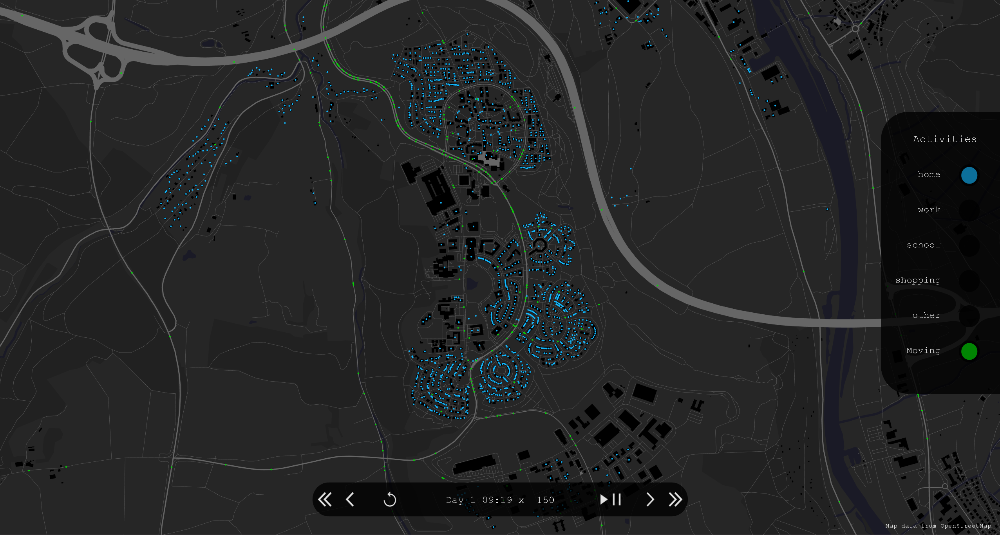

# Visualization tool for mobility demand generated by OMOD

[![CC BY-NC 4.0][cc-by-nc-shield]][cc-by-nc]

---

<p align="center">
   
   
</p>

---

## OMOD

https://github.com/L-Strobel/omod

## Get Started

You need Java 17 or a later version.

1. Download the latest release (see *Releases* on the right)
2. Obtain OMOD output, see https://github.com/L-Strobel/omod. Must be in JSON format.
3. Download OSM data that covers the OMOD output. Large files will lead to long start up times on the first run. Recommended download site: https://download.geofabrik.de/
4. Run Visualizer:

   ```
   java -jar omod-visualizer-natives-windows-1.0-all.jar Path/to/OMOD.json Path/to/osm.pbf 
   ```

## License

This work is licensed under a
[Creative Commons Attribution-NonCommercial 4.0 International License][cc-by-nc].

[![CC BY-NC 4.0][cc-by-nc-image]][cc-by-nc]

[cc-by-nc]: https://creativecommons.org/licenses/by-nc/4.0/
[cc-by-nc-image]: https://licensebuttons.net/l/by-nc/4.0/88x31.png
[cc-by-nc-shield]: https://img.shields.io/badge/License-CC%20BY--NC%204.0-lightgrey.svg